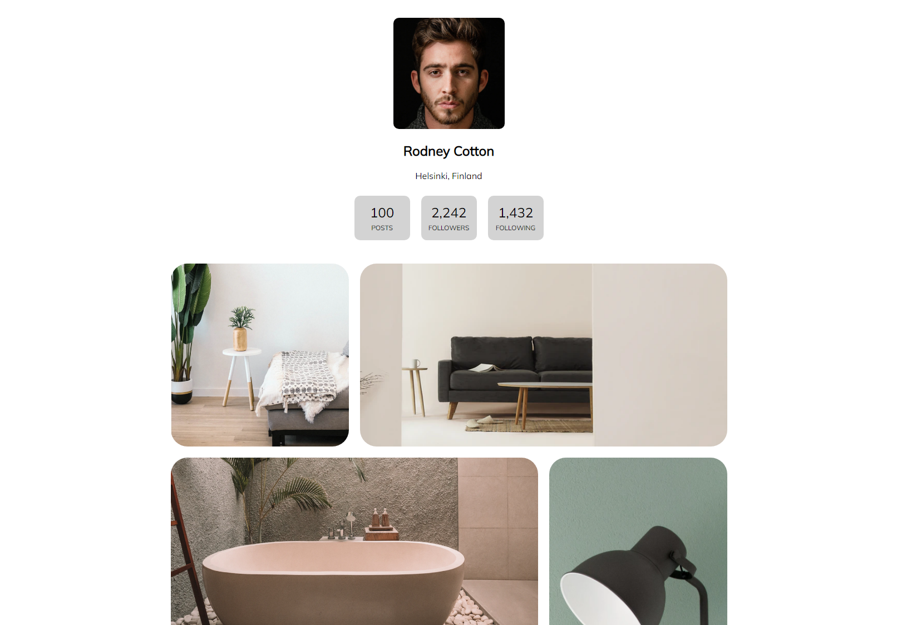

<!-- Please update value in the {}  -->

<h1 align="center">My Gallery</h1>

   Solution for a challenge from  <a href="http://devchallenges.io" target="_blank">Devchallenges.io</a>.

  <h3>
    <a href="https://cloudberries27.github.io/DevChallenge-MyGallery/">
      Demo
    </a>
     | 
    <a href="https://github.com/cloudberries27/DevChallenge-MyGallery">
      Solution
    </a>
     | 
    <a href="https://devchallenges.io/challenges/gcbWLxG6wdennelX7b8I">
      Challenge
    </a>
  </h3>

<!-- TABLE OF CONTENTS -->

## Table of Contents

- [Overview](#overview)
  - [Built With](#built-with)
- [Features](#features)
- [Acknowledgements](#acknowledgements)
- [Contact](#contact)

<!-- OVERVIEW -->

## Overview

- Demo is above ^^^
- Pretty simple, I would say. IDK I did this one in like two hours. I mostly knew everything. 
- I'm not a fan of the design. Font colors and background colors should never be that similar, its an accessibility issue. The mobile design is also unique, I feel most websites would adjust their pictures to be bigger. 
- Second Inspirational Quote of the Day: "Testing leads to failure, and failure leads to understanding" - Burt Rutan 

### Built With

<!-- This section should list any major frameworks that you built your project using. Here are a few examples.-->

- HTML
- CSS

## Features

<!-- List the features of your application or follow the template. Don't share the figma file here :) -->

This application/site was created as a submission to a [DevChallenges](https://devchallenges.io/challenges) challenge. The [challenge](https://devchallenges.io/challenges/gcbWLxG6wdennelX7b8I) was to build an application to complete the given user stories.

## Acknowledgements

<!-- This section should list any articles or add-ons/plugins that helps you to complete the project. This is optional but it will help you in the future. For exmpale -->

- [Responsive Grid](https://www.freecodecamp.org/news/how-to-create-an-image-gallery-with-css-grid-e0f0fd666a5c/)

## Contact

- Website [fanamera.com](https://fanamera.com)
- GitHub [@cloudberries27](https://github.com/cloudberries27)
- Codepen [@cloudberries27](https://codepen.io/cloudberries27)